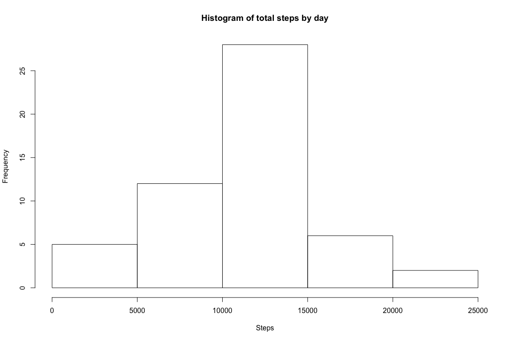
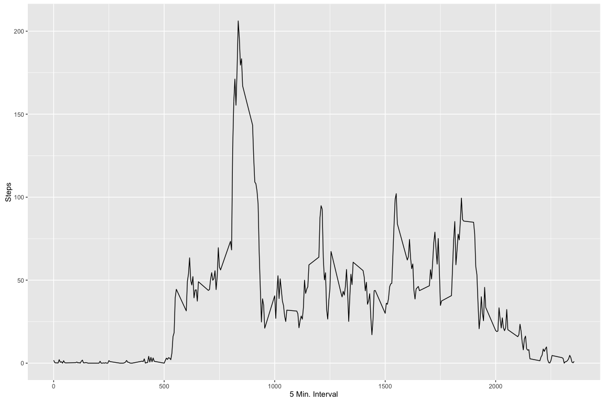
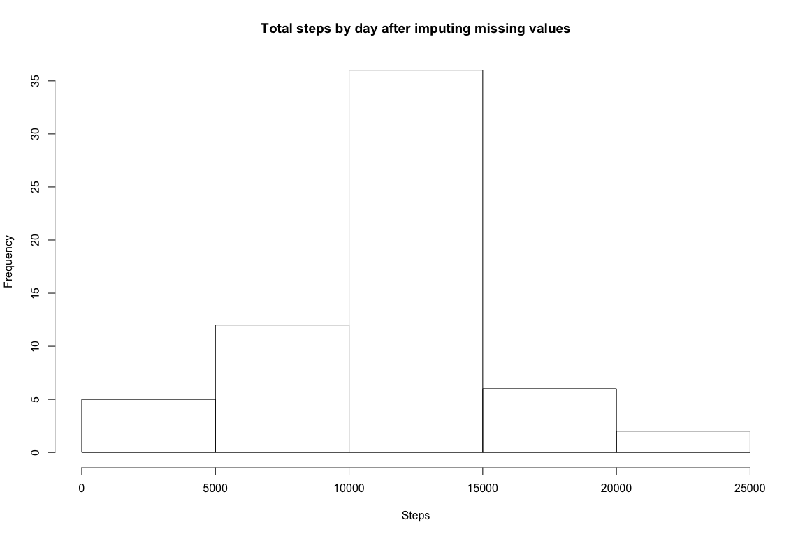
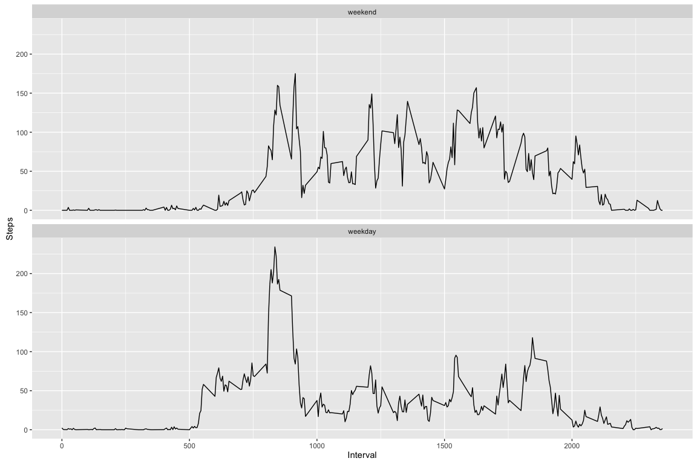

# Reproducible Research: Peer Assessment 1
Sanchal Kunnel  
May 11, 2016  


## Loading and preprocessing the data

### Read the file by unzipping the zip and read the csv contained within


```r
activityDt <- read.csv(unz("activity.zip", "activity.csv"), header=TRUE, sep=",")
```


## What is mean total number of steps taken per day?

###Calculate the total number of steps taken per day

```r
aggDt <- aggregate(activityDt$steps , by = list(activityDt$date), FUN = sum )
colnames(aggDt) <- c("Date","Steps")
```

###Histogram of the total number of steps taken each day

```r
hist(aggDt$Steps, xlab = "Steps" , main = "Histogram of total steps by day")
```



###Median and Mean of total steps by day

```r
summary(aggDt$Steps)[c("Median","Mean")]
```

```
## Median   Mean 
##  10760  10770
```

##What is the average daily activity pattern?

###Time series plot of the average number of steps taken

```r
library(ggplot2)

aggDtInterval <- aggregate(activityDt$steps , by = list(activityDt$interval), FUN = mean, na.rm =  TRUE)
colnames(aggDtInterval) <- c("Interval","Steps")

ggplot(aggDtInterval, aes(Interval, Steps)) + geom_line() +
xlab("5 Min. Interval") + ylab("Steps")
```



###The 5-minute interval that, on average, contains the maximum number of steps

```r
maxIntvl <- aggDtInterval[which(aggDtInterval$Steps == max(aggDtInterval$Steps)), c("Interval") ]
```

####The interval the on average has maximum number of steps is 835.

## Imputing missing values

###Total number of missing values in the dataset 

```r
missingValues <- sum(is.na(activityDt$steps))
```
####There are 2304 missing values.

###Strategy for filling in all of the missing values in the dataset

We will fill in the missing values by taking the mean of all the values for that interval

```r
library(dplyr)
activityDtImpute <- activityDt %>% group_by(interval) %>% mutate(steps= replace(steps, is.na(steps), mean(steps, na.rm=TRUE)))
```

Create a new dataset that is equal to the original dataset but with the missing data filled in with the mean of the values for that interval.

```r
aggDtImpute <- aggregate(activityDtImpute$steps , by = list(activityDtImpute$date), FUN = sum, na.rm =  FALSE)
```

###Histogram of the total number of steps taken each day after missing values are imputed

```r
hist(aggDtImpute$x, xlab = "Steps" , main = "Total steps by day after imputing missing values")
```



###Median and Mean of total steps by day

```r
summary(aggDtImpute$x)[c("Median","Mean")]
```

```
## Median   Mean 
##  10770  10770
```

####The result of imputing values is that the mean remains the same , but the median has increased a little. Looking at the histogram it appears the increase in frequency happenned between 10,000 and 15,000 steps . This corelates to the fact that we populated the missing data taking the mean of the values for that interval .

## Are there differences in activity patterns between weekdays and weekends?

###Create a new factor variable in the dataset with two levels – “weekday” and “weekend”

```r
#convert the date column to a Date
activityDt$date <- as.Date(activityDt$date)
#add a new factor column that indicates if the row is a weekday or weekend
activityDt$wday <- factor((weekdays(activityDt$date) %in% c("Saturday","Sunday")),levels=c(TRUE, FALSE), labels=c('weekend', 'weekday'))
```

###Make a panel plot containing a time series plot of the intervals and the average steps taken

```r
#aggregate the data by taking the average of steps by weekday or weekend
aggDtIntervalWk <- aggregate(activityDt$steps , by = list(activityDt$interval,activityDt$wday), FUN = mean, na.rm =  TRUE)
ggplot(aggDtIntervalWk, aes(Group.1, x)) + geom_line() +xlab("Interval") + ylab("Steps") + facet_grid(~Group.2) +facet_wrap(~Group.2, nrow = 2)
```



####From the plot we can see that there are more steps bfore 10 AM on the weekdays than the weekends.Also , there seems to be more steps between 10 AM and 8 PM on the weekends than the weekdays.
